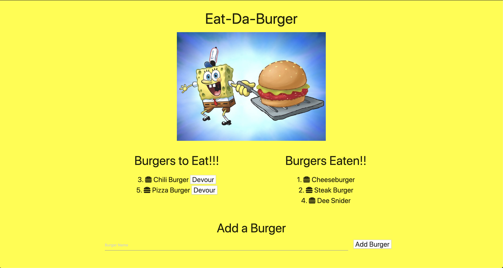

# burger
 
## Description
The burger app is a app that takes user input (a burger name) and adds it to a MySQL database. When the data is added the buger isnt devoured (devoured is set to false by default), with a click of a button the user can update MySQL database and change the burger's devoured status to true. The app allows the user to be able to see which burgers have been devoured and which have not. For the app to work. The app us the Model-View-Controller (MVC) model to be abel to be well organized and work properly. The following npm packages were used for this app: 
* Express
* Express-Handlebars
* MySQL

## Installation/Usage
Please ensure to do the following before running code:
* Run `npm install`
* Ensure to use the `schema.sql` to create database and table (`seeds.sql` is optional)
* To run code type `npm start`

A deployed version of the app can be found [here on Heroku](https://frozen-retreat-67912.herokuapp.com/)  
Below is a screenshot of the working app  

## License
MIT License

Copyright (c) 2020 Alex Bailon

Permission is hereby granted, free of charge, to any person obtaining a copy of this software and associated documentation files (the "Software"), to deal in the Software without restriction, including without limitation the rights to use, copy, modify, merge, publish, distribute, sublicense, and/or sell copies of the Software, and to permit persons to whom the Software is furnished to do so, subject to the following conditions:

The above copyright notice and this permission notice shall be included in all copies or substantial portions of the Software.

THE SOFTWARE IS PROVIDED "AS IS", WITHOUT WARRANTY OF ANY KIND, EXPRESS OR IMPLIED, INCLUDING BUT NOT LIMITED TO THE WARRANTIES OF MERCHANTABILITY, FITNESS FOR A PARTICULAR PURPOSE AND NONINFRINGEMENT. IN NO EVENT SHALL THE AUTHORS OR COPYRIGHT HOLDERS BE LIABLE FOR ANY CLAIM, DAMAGES OR OTHER LIABILITY, WHETHER IN AN ACTION OF CONTRACT, TORT OR OTHERWISE, ARISING FROM, OUT OF OR IN CONNECTION WITH THE SOFTWARE OR THE USE OR OTHER DEALINGS IN THE SOFTWARE.
